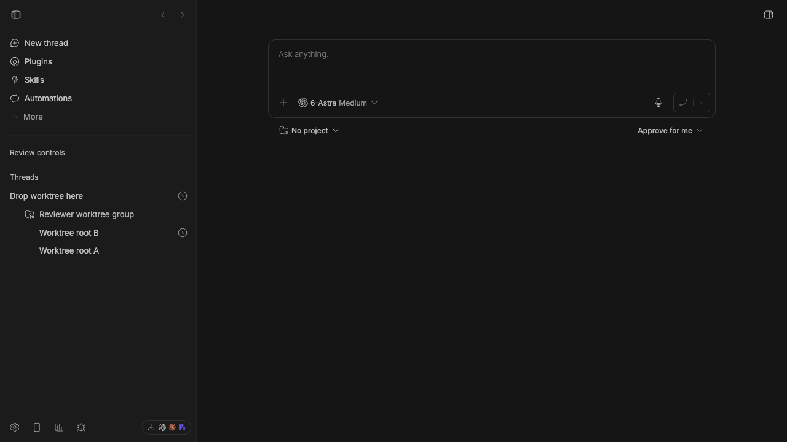
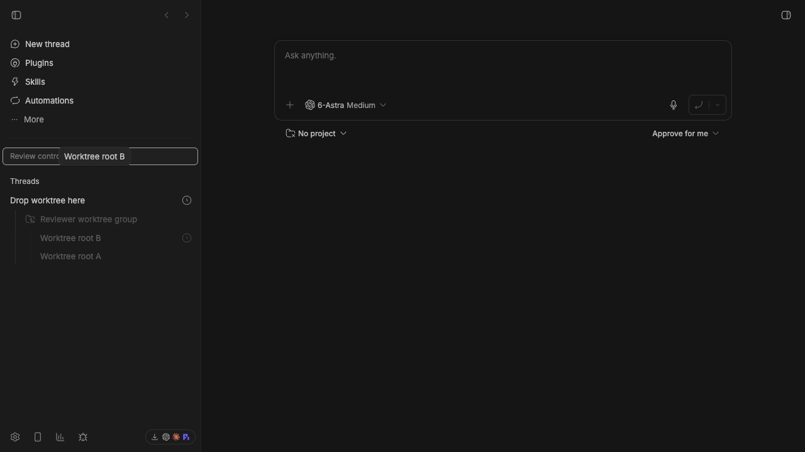
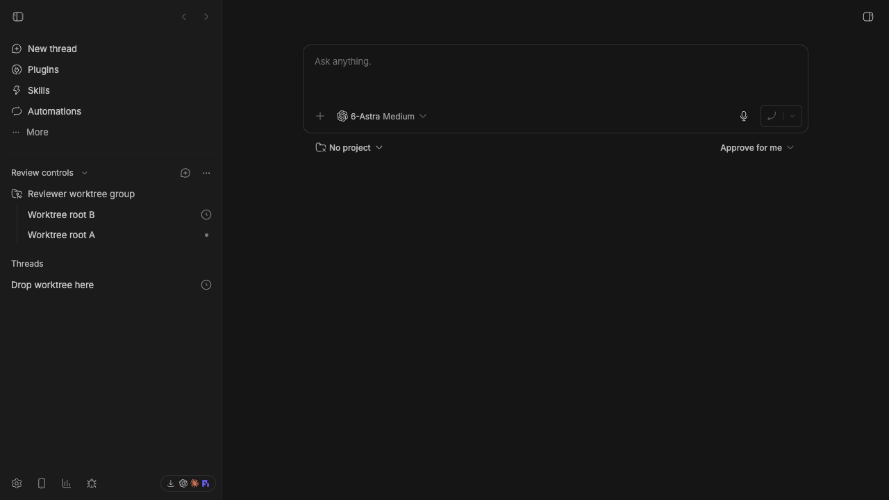

# Worktree drag-to-parent reviewer handoff

## Issue and solution

Dragging a worktree/environment group onto a thread could not create a parent relationship because grouped drags were excluded from thread-row nest targets. Thread nesting also felt unreliable because the valid vertical band was narrow, hover activation was slow, and horizontal cancellation used the dragged card edge rather than the pointer.

The fix adds a `nest-group` decision that reparents only the worktree group's root threads, preserving descendants and rejecting cycles. Its symmetric `detach-group` decision clears only those root relationships when the group is dropped on a section, moves every represented thread to that section, and preserves descendants. The target band is now the middle 70% of the row, expands to the whole row once armed, activates after 200 ms, and uses the pointer with 12 px of left-side tolerance.

- Pull request: [#4078](https://github.com/get-bb/bb/pull/4078)
- Related issue: [#3029](https://github.com/get-bb/bb/issues/3029) covers stale sidebar placement after a different reparenting path; this change does not close it.

## Visual evidence

| Before | Valid drag target | After drop |
| --- | --- | --- |
|  |  |  |

| Before unparenting | Valid section target | After unparenting |
| --- | --- | --- |
|  |  |  |

## Focused verification

- `pnpm exec turbo run test --filter=bb-plugin-thread-list --force -- --run app/dnd/useSectionThreadDnd.test.ts app/dnd/useSectionThreadDnd.projection.test.tsx` — 46 passed
- `pnpm exec turbo run typecheck --filter=bb-plugin-thread-list --force` — passed
- `pnpm exec turbo run test --filter=@bb/app --force -- --run src/components/sidebar/useSectionThreadDnd.test.ts src/components/sidebar/useSectionThreadDnd.projection.test.tsx` — 46 passed
- `pnpm exec turbo run typecheck --filter=@bb/app --force` — passed
- Source-app smoke tests confirmed both parenting and section-drop unparenting persisted for both roots, preserved the shared environment, updated immediately, and survived reload.
- Follow-up CI: pending the final PR-head run. See the [PR checks](https://github.com/get-bb/bb/pull/4078/checks).

The verification inventory also reports pre-existing recipe drift: `Unmapped CLI family: browser; add recipes and an explicit owner`.

## Live reviewer fixture

- Preview: [BB Connect source build](https://ymichael--24976.getbb.app)
- Project: `Worktree drag review` (`proj_mgv855fe5d`)
- Group: `Reviewer worktree group` (`env_viznrhpzke`)
- Roots: `Worktree root A` (`thr_d768km8z9q`) and `Worktree root B` (`thr_3u5ntwpz98`)
- Target: `Drop worktree here` (`thr_dsgc8btyaw`)

In the sidebar thread menu, choose **Organize → Custom** and enable **By environment**. The seeded group starts beneath `Drop worktree here`. Drag the `Reviewer worktree group` row onto `Review controls` and release when the section outline appears. Both roots should move into that section with no parent while remaining in one worktree group.

The source server is running at `http://127.0.0.1:24976`. From this worktree, reset the fixture with:

```sh
env -u BB_PROJECT_ID -u BB_THREAD_ID -u BB_HOST_ID BB_SERVER_URL=http://127.0.0.1:24976 node apps/cli/dist/index.js thread update thr_d768km8z9q --parent-thread thr_dsgc8btyaw --clear-section
env -u BB_PROJECT_ID -u BB_THREAD_ID -u BB_HOST_ID BB_SERVER_URL=http://127.0.0.1:24976 node apps/cli/dist/index.js thread update thr_3u5ntwpz98 --parent-thread thr_dsgc8btyaw --clear-section
```

Verify persisted state with:

```sh
for review_id in thr_d768km8z9q thr_3u5ntwpz98; do
  env -u BB_PROJECT_ID -u BB_THREAD_ID -u BB_HOST_ID BB_SERVER_URL=http://127.0.0.1:24976 node apps/cli/dist/index.js thread show "$review_id" --json | jq '.thread | {id, parentThreadId, sectionId, environmentId}'
done
```

After the drag, each `parentThreadId` must be `null`, each `sectionId` must be `sec_s2ic9myvww`, and each `environmentId` must remain `env_viznrhpzke`. After reset, each `parentThreadId` must be `thr_dsgc8btyaw` and each `sectionId` must be `null`. Both transitions were exercised against the live fixture before handoff.
